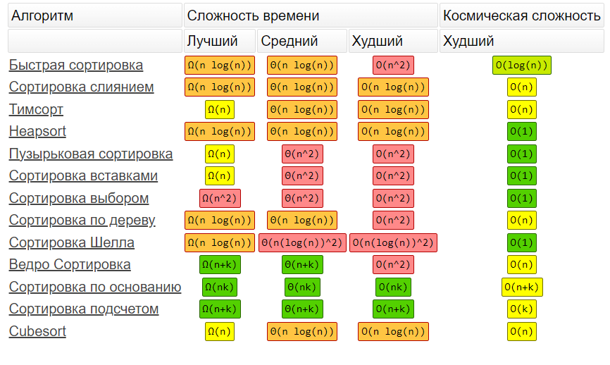
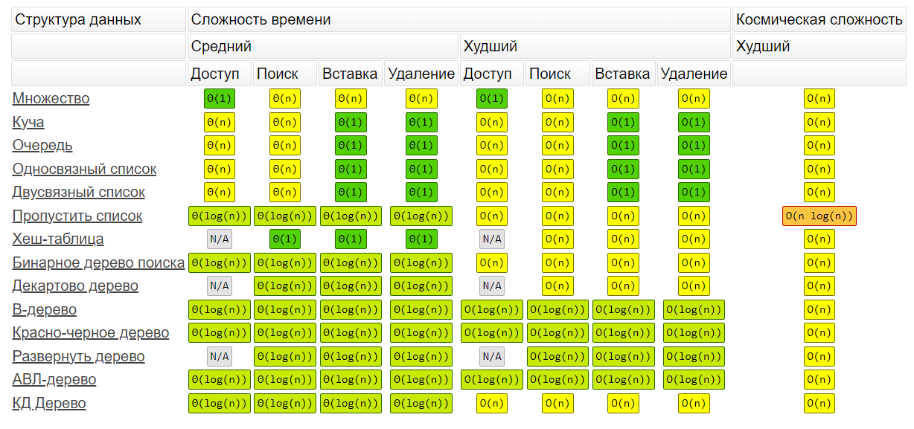

# Алгоритмы

## Содержание

---

- Алгоритмическая сложность
- Алгоритмы поиска
    - Бинарный поиск
    - Поиск в глубину
    - Поиск в ширину
- Алгоритмы сортировки
    - Пузырькова
    - Быстрая
    - Выбором
    - Универсальная
    - Перемешиванием
    - Расческой
    - Гномья
    - Вставками
    - Слиянием
    - Терпеливая
    - Шелла
- Cтруктуры данных
    - Связный список
    - Двусвязный список
    - Очередь и стек
    - Граф
    - Деревья
    - Хэш

---

[//]: # (https://vk.com/@miet_acm-lekciya-2-algoritmy-sortirovki-i-poiska)

## Алгоритмическая сложность

`Сложность алгоритма` - это количественная характеристика, которая говорит о том, сколько времени, либо какой объём
памяти
потребуется для выполнения алгоритма.

`Временная сложность в худшем случае `– функция размера входа, равная максимальному количеству операций, выполненных в
ходе работы алгоритма при решении задачи данного размера.

`Ёмкостная сложность в худшем случае` – функция размера входа, равная максимальному количеству ячеек памяти, к которым
было обращение при решении задач данного размера.

`Асимптотически норма́льная оценка` — в математической статистике оценка, распределение которой стремится к
нормальному распределению при увеличении размера выборки. (сложность зависит от количества элементов)

Измерение времени выполнения алгоритма.

```php
$start = microtime(true);
quickSort($items);
print_r(microtime(true) - $start);

// или
function microseconds() {
    $mt = explode(' ', microtime());
    [$msec, $sec] = $mt;
    return (int)$sec * 1000000 + ((int) round($msec * 1000000));
}
```

Довольно часто время выполнения алгоритмов имеет большой разброс, в этом случае использують статический метод. Нужно
разделить общее время выполнения на количество запусков, чтобы вычислить среднее время выполнения:

```php
function averagePerformance($f, $count)
{
    $start = microseconds();

    for ($i = 0; $i < $count; $i++) {
        $f();
    }

    $end = microseconds();
    return ($end - $start) / $count;
}

$items = [86, 66, 44, 77, 56, 64, 76, 39, 32, 93, 33, 54, 63, 96, 5, 41, 20, 58, 55, 28];
print_r(averagePerformance(fn() => quickSort([...$items]), 1)); // [...$items] - копия массива
print_r(averagePerformance(fn() => quickSort([...$items]), 10)); 
```

Оценка сложности:

- `O` – оценка для худшего случая (нотация О-большое, "Ordnung")
- `Ω` - оценка для хорошего случая
- `Θ` - оценка для среднего случая

Порядок роста функций (расположены в порядке возрастания сложности):

- `O(1)` — константная (Длина массива)
- `O(log n)` — логарифмическая сложность (Бинарный поиск)
- `O(n)` — линейная сложность (Поиск методом перебора)
- `O(n log n)`— линейно-логарифмическая сложность (Быстрая сортировка)
- `O(n^2)` — квадратичная сложность (Пузырьковая сортировка)
- `2^O(n)` — экспоненциальная (Список подмассивов)
- `O(n!)` — факториальная сложность (Список перестановок)

На [этой](https://www.bigocheatsheet.com/) веб-странице рассматриваются пространственные и временные сложности
распространенных алгоритмов, используемых в информатике

Подсчет памяти

```php
echo "Start\n";
memoryUsage(memory_get_usage(), $base_memory_usage);

$a = someBigValue();

echo "String value setted\n";
memoryUsage(memory_get_usage(), $base_memory_usage);

// Чтобы получить использование памяти в привычном виде
function memoryUsage($usage, $base_memory_usage)
{
    $mem_usage = $usage - $base_memory_usage;
    if ($mem_usage < 1024) {
        echo $mem_usage . " bytes";
    } elseif ($mem_usage < 1048576) {
        echo round($mem_usage / 1024, 2) . " kilobytes";
    } else {
        echo round($mem_usage / 1048576, 2) . " megabytes";
    }
}
```

---

## Алгоритмы поиска

## Бинарный поиск

Плюсы:

1. Реализация алгоритма достаточна легкая (Относительно)
2. Быстрая работа алгоритма

Минусы:

1. Для поиска массив должен быть упорядочен(отсортирован)
2. Двоичный поиск должен иметь возможность обратится к любому элементу данных (по индексу). А это значит, что все
   структуры данных, которые построены на связных списках использоваться не могут

Если нужно искать в небольших массивах, можно использовать метод перебора — он будет работать со сравнимой скоростью или
даже быстрее.

```php
$stopWords = ['а', 'без', 'ближе', 'браво', 'бы', 'вам', 'вас', 'весь', 'во', 'все', 'всего', 'вы'];

function isStopWord($candidate)
{
    $first = 0;
    $last = count($stopWords) - 1;

    while ($first <= $last) {
        $middle = round(($first + $last) / 2);

        if ($candidate === $stopWords[$middle]) {
            return true;
        }

        if ($candidate < $stopWords[$middle]) {
            $last = $middle - 1;
        } else {
            $first = $middle + 1;
        }
    }

    return false;
};

// Рекурсивный способ
function binarySearch($items, $value, $left, $right)
{
   if ($left > $right) {
      return -1;
   }

   $middle = round(($left + $right) / 2);
   if ($value === $items[$middle]) {
      return $middle;
   }

   if ($value < $items[$middle]) {
      return binarySearch($items, $value, $left, $middle - 1);
   }

   return binarySearch($items, $value, $middle + 1, $right);
}

$items = [-3, -1, 1, 3, 5, 7, 9, 11];
print_r(binarySearch($items, 100, 0, count($items) )); // => -1
print_r(binarySearch($items, -1, 0, count($items) )); // => 1
print_r(binarySearch($items, 7, 0, count($items) )); // => 5

```

---

# Сортировки



## Сортировка пузырьком / Bubble sort

Этот алгоритм считается учебным и почти не применяется на практике из-за низкой эффективности: он медленно работает на
тестах, в которых маленькие элементы (их называют «черепахами») стоят в конце массива. Однако на нём основаны многие
другие методы, например, шейкерная сортировка и сортировка расчёской.

<details>
<summary>PHP</summary>

```php
function bubbleSort1(array $data)
{
    $count_elements = count($data);
    $iterations = $count_elements - 1;

    for ($i = 0; $i < $count_elements; $i++) {
        $changes = false;
        for ($j = 0; $j < $iterations; $j++) {
            if ($data[$j] > $data[($j + 1)]) {
                $changes = true;
                list($data[$j], $data[($j + 1)]) = array($data[($j + 1)], $data[$j]);
            }
        }
        $iterations--;
        if (!$changes) {
            return $data;
        }
    }
    return $data;
}

function bubbleSort2(array $array)
{
    // перебираем массив
    for ($j = 0; $j < count($array) - 1; $j++) {
        for ($i = 0; $i < count($array) - $j - 1; $i++) {
            // если текущий элемент больше следующего
            if ($array[$i] > $array[$i + 1]) {
                // меняем местами элементы
                $tmp_var = $array[$i + 1];
                $array[$i + 1] = $array[$i];
                $array[$i] = $tmp_var;
            }
        }
    }
    return $array;
}

function bubbleSort3(array &$array) {
  $c = count($array) - 1;
  do {
    $swapped = false;
    for ($i = 0; $i < $c; ++$i) {
      if ($array[$i] > $array[$i + 1]) {
      
//                $tmp = $arr[$i];
//                $arr[$i] = $arr[$k];
//                $arr[$k] = $tmp;
      
        list($array[$i + 1], $array[$i]) =
                array($array[$i], $array[$i + 1]);
        $swapped = true;
      }
    }
  } while ($swapped);
  return $array;
}


```

</details>

| Сложность | 	Лучшее	 | Среднее | Худшее |
|-----------|----------|---------|--------|
| Время     | 	O(n)	   | O(n2)	  | O(n2)  |
| Память    | 	 	      |         | 	O(1)  |

## Быстрая

```php
function quicksort($arr){
	$loe = $gt = array();
	if(count($arr) < 2){
		return $arr;
	}
	$pivot_key = key($arr);
	$pivot = array_shift($arr);
	foreach($arr as $val){
		if($val <= $pivot){
			$loe[] = $val;
		}elseif ($val > $pivot){
			$gt[] = $val;
		}
	}
	return array_merge(quicksort($loe),array($pivot_key=>$pivot),quicksort($gt));
}
```

## Выбором

```php
function selection_sort(&$arr) {
    $n = count($arr);
    for($i = 0; $i < count($arr); $i++) {
        $min = $i;
        for($j = $i + 1; $j < $n; $j++){
            if($arr[$j] < $arr[$min]){
                $min = $j;
            }
        }
       
        list($arr[$i],$arr[$min]) = array($arr[$min],$arr[$i]);
    }
}
```

## Универсальная

```php
$products = [
    ['name' => 'Телевизор', 'price' => 100000, 'rating' => 9.1],
    ['name' => 'Холодильник', 'price' => 20000, 'rating' => 8.3],
    ['name' => 'Пылесос', 'price' => 14000, 'rating' => 7.5],
    ['name' => 'Стиральная машина', 'price' => 30000, 'rating' => 9.2],
    ['name' => 'Миелофон', 'price' => 200000, 'rating' => 8.7],
    ['name' => 'Микроволновка', 'price' => 7000, 'rating' => 8.2],
    ['name' => 'Проигрыватель', 'price' => 20000, 'rating' => 9.0],
    ['name' => 'Посудомоечная машина', 'price' => 80000, 'rating' => 7.8],
    ['name' => 'Мультиварка', 'price' => 5000, 'rating' => 7.1],
];

function compareByPrice($item1, $item2): int
{
    if ($item1['price'] < $item2['price']) {
        return -1;
    } else {if ($item1['price'] == $item2['price']) {
        return 0;
    } else {
        return 1;
    }}
}

function bubbleSort(&$items, $comparator)
{
    for ($limit = count($items) - 1; $limit > 0; $limit -= 1) {
        for ($i = 0; $i < $limit; $i += 1) {
            if ($comparator($items[$i], $items[$i + 1]) > 0) {
                $temporary = $items[$i];
                $items[$i] = $items[$i + 1];
                $items[$i + 1] = $temporary;
            }
        }
    }
}

bubbleSort($products, 'compareByPrice');
```

## Перемешиванием

```php
function cocktailSort($arr){
	if (is_string($arr)) {$arr = str_split(preg_replace('/\s+/','',$arr));}
 
	do{
		$swapped = false;
		for($i=0;$i<count($arr);$i++){
			if(isset($arr[$i+1])){
				if($arr[$i] > $arr[$i+1]){
					list($arr[$i], $arr[$i+1]) = array($arr[$i+1], $arr[$i]);
					$swapped = true;
				}
			}			
		}
 
		if ($swapped == false) {break;}
 
		$swapped = false;
		for($i=count($arr)-1;$i>=0;$i--){
			if(isset($arr[$i-1])){
				if($arr[$i] < $arr[$i-1]) {
					list($arr[$i],$arr[$i-1]) = array($arr[$i-1],$arr[$i]);
					$swapped = true;
				}
			}
		}
	}while($swapped);
 
	return $arr;
}
```

## Расческой

```php
function combSort($arr){
	$gap = count($arr);
        $swap = true;
	while ($gap > 1 || $swap){
		if($gap > 1) {$gap /= 1.25;}
 
		$swap = false;
		$i = 0;
		while($i+$gap < count($arr)){
			if($arr[$i] > $arr[$i+$gap]){
				list($arr[$i], $arr[$i+$gap]) = array($arr[$i+$gap],$arr[$i]);
				$swap = true;
			}
			$i++;
		}
	}
	return $arr;
}

```

## Гномья

```php

function gnomeSort($arr){
	$i = 1;
	$j = 2;
	while($i < count($arr)){
		if ($arr[$i-1] <= $arr[$i]){
			$i = $j;
			$j++;
		}else{
			list($arr[$i],$arr[$i-1]) = array($arr[$i-1],$arr[$i]);
			$i--;
			if($i == 0){
				$i = $j;
				$j++;
			}
		}
	}
	return $arr;
}

```

## Вставками

```php
function insertionSort(&$arr){
	for($i=0;$i<count($arr);$i++){
		$val = $arr[$i];
		$j = $i-1;
		while($j>=0 && $arr[$j] > $val){
			$arr[$j+1] = $arr[$j];
			$j--;
		}
		$arr[$j+1] = $val;
	}
}
```

## Слиянием

```php
function mergesort($arr){
	if(count($arr) == 1 ) {return $arr;}
	$mid = count($arr) / 2;
    $left = array_slice($arr, 0, $mid);
    $right = array_slice($arr, $mid);
	$left = mergesort($left);
	$right = mergesort($right);
	return merge($left, $right);
}
 
function merge($left, $right){
	$res = array();
	while (count($left) > 0 && count($right) > 0){
		if($left[0] > $right[0]){
			$res[] = $right[0];
			$right = array_slice($right , 1);
		}else{
			$res[] = $left[0];
			$left = array_slice($left, 1);
		}
	}
	while (count($left) > 0){
		$res[] = $left[0];
		$left = array_slice($left, 1);
	}
	while (count($right) > 0){
		$res[] = $right[0];
		$right = array_slice($right, 1);
	}
	return $res;
}
```

## Терпеливая

```php

class PilesHeap extends SplMinHeap {
    public function compare($pile1, $pile2) {
        return parent::compare($pile1->top(), $pile2->top());
    }
}
 
function patience_sort(&$n) {
    $piles = array();
    // sort into piles
    foreach ($n as $x) {
        // binary search
        $low = 0; $high = count($piles)-1;
        while ($low <= $high) {
            $mid = (int)(($low + $high) / 2);
            if ($piles[$mid]->top() >= $x)
                {$high = $mid - 1;}
            else
                {$low = $mid + 1;}
        }
        $i = $low;
        if ($i == count($piles))
            {$piles[] = new SplStack();}
        $piles[$i]->push($x);
    }
 
    // priority queue allows us to merge piles efficiently
    $heap = new PilesHeap();
    foreach ($piles as $pile)
        {$heap->insert($pile);}
    for ($c = 0; $c < count($n); $c++) {
        $smallPile = $heap->extract();
        $n[$c] = $smallPile->pop();
        if (!$smallPile->isEmpty())
        {$heap->insert($smallPile);}
    }
    assert($heap->isEmpty());
}
```

## Шелла

```php
function shellSort($arr)
{
	$inc = round(count($arr)/2);
	while($inc > 0)
	{
		for($i = $inc; $i < count($arr);$i++){
			$temp = $arr[$i];
			$j = $i;
			while($j >= $inc && $arr[$j-$inc] > $temp)
			{
				$arr[$j] = $arr[$j - $inc];
				$j -= $inc;
			}
			$arr[$j] = $temp;
		}
		$inc = round($inc/2.2);
	}
	return $arr;
}
```

---

## Cтруктуры данных

`Структура данных` — это способ организации информации для более эффективного использования. В программировании
структурой
обычно называют набор данных, связанных определённым образом.

- Связный список
- Стек
- Очередь
- Множество
- Map
- Хэш-таблица
- Двоичное дерево поиска
- Префиксное дерево
- Двоичная куча
- Граф
- Полезные ссылки

Эффективные структуры данных для PHP 7, представленные как альтернативы для типа array

```php
git clone https://github.com/php-ds/extension "php-ds"
```



## Связный список

`Связанный список` – массив где каждый элемент является отдельным объектом и состоит из двух элементов – данных и ссылки
на следующий узел.

Бывают:

- `Однонаправленный`, каждый узел хранит адрес или ссылку на следующий узел в списке и последний узел имеет следующий
  адрес или ссылку как NULL. (1->2->3->4->NULL)

- `Двунаправленный`, две ссылки, связанные с каждым узлом, одним из опорных пунктов на следующий узел и один к
  предыдущему
  узлу. (NULL<-1<->2<->3->NULL)

- `Круговой`, все узлы соединяются, образуя круг. В конце нет NULL. Циклический связанный список может быть одно-или
  двукратным циклическим связанным списком. (1->2->3->1)

Основные операции

- insertAtEnd — Вставка заданного элемента в конец списка
- insertAtHead — Вставка элемента в начало списка
- delete — удаляет заданный элемент из списка
- deleteAtHead — удаляет первый элемент списка
- search — возвращает заданный элемент из списка
- isEmpty — возвращает True, если связанный список пуст

<details>
<summary>DoubleLinkedList</summary>

```php
class LinkedListNode
{
    public function __construct($value, $next = null)
    {
        $this->value = $value;
        $this->next = $next;
    }
}


class LinkedList
{

    public function __construct()
    {
        $this->head = null;
        $this->tail = null;
    }

    // Вставка элемента в начало списка
    public function insertAtHead($value)
    {
        // Делаем новый узел головой
        $newNode = new LinkedListNode($value, $this->head);
        $this->head = $newNode;

        // Если нет хвоста, этот узел будет и хвостом
        if (!$this->tail) {
            $this->tail = $newNode;
        }

        return $this;
    }

    // Вставка элемента в конец списка
    public function insertAtEnd($value)
    {
        $newNode = new LinkedListNode($value);

        // Если нет головы, этот узел будет головой
        if (!$this->head) {
            $this->head = $newNode;
            $this->tail = $newNode;

            return $this;
        }

        // Присоединяем новый узел к концу, делаем его хвостом
        $this->tail->next = $newNode;
        $this->tail = $newNode;

        return $this;
    }

    // Удаление элемента
    public function deleteAtHead()
    {
        if ($this->head === null) {
            return undefined;
        }
    
        $value = $this->head->value;
        $this->head = $this->head->next;
    
        return $value;
    }

    // Удаление элемента
    public function delete($value)
    {
        if (!$this->head) {
            return null;
        }

        $deletedNode = null;
        // Проверяем с головы какие ноды надо удалить
        while ($this->head && $this->head->value === $value) {
            $deletedNode = $this->head;
            $this->head = $this->head->next;
        }

        $currentNode = $this->head;

        // Если у головы не нашли, проверяем остальные значения в списке
        if ($currentNode !== null) {
            while ($currentNode->next) {
                if ($currentNode->next->value === $value) {
                    $deletedNode = $currentNode->next;
                    $currentNode->next = $currentNode->next->next;
                } else {
                    $currentNode = $currentNode->next;
                }
            }
        }

        // Проверяем хвост
        if ($this->tail->value === $value) {
            $this->tail = $currentNode;
        }

        return $deletedNode;
    }

    // Поиск элемента
    public function search($value)
    {
        if (!$this->head) {
            return null;
        }

        $currentNode = $this->head;

        // Перебираем список с головы, первое найденное значение возвращаем
        while ($currentNode) {
            if ($value !== null && $currentNode->value === $value) {
                return $currentNode;
            }

            // Делаем текущей следующий элемент списка
            $currentNode = $currentNode->next;
        }

        return null;
    }

    // проверку на пустоту
    public function isEmpty()
    {
        return $this->head === null && $this->tail === null;
    }

    public function toArray()
    {
        $result = [];

        if (!$this->head) {
            return $result;
        }

        $currentNode = $this->head;

        while ($currentNode) {
            if ($currentNode->value !== null) {
                $result[] = $currentNode->value;
            }

            $currentNode = $currentNode->next;
        }

        return $result;
    }

    // Определение длины списка
    public function length()
    {
        $result = 0;
        $current = $this->head;

        while ($current !== null) {
            $result = $result + 1;
            $current = $current->next;
        }

        return $result;
    }

    // Вставка элемента в середину или конец списка
    public function insert($index, $value)
    {
        if ($this->head === null) {
            $this->head = new LinkedListNode($value, null);
        } else {
            if ($index === 0) {
                $this->insertAtHead($value);
            } else {
                $current = $this->head;
                while ($current->next !== null && $index > 0) {
                    $current = $current->next;
                    $index = $index - 1;
                }

                $current->next = new LinkedListNode($value, $current->next);
            }
        }
    }
}


$node = new LinkedListNode(1, new LinkedListNode(4, null));
$list = new LinkedList();
```

</details>

|                      | Массив | Список |
|----------------------|--------|--------|
| Вставка в начало     | O(n)   | O(1)   |
| Вставка в середину   | O(n)   | O(n)   |
| Вставка в конец      | O(n)   | O(n)   |
| Доступ по индексу    | O(1)   | O(n)   |
| Удаление из начала   | O(n)   | O(1)   |
| Удаление из середины | O(n)   | O(n)   |
| Удаление из конца    | O(n)   | O(n)   |
| Поиск                | O(n)   | O(n)   |
| Длина                | O(1)   | O(n)   |

<details>
<summary>DoubleLinkedList</summary>

```php
class DoubleLinkedListNode
{
    public function __construct($value, $next = null, $previous = null)
    {
        $this->value = $value;
        $this->next = $next;
        $this->previous = $previous;
    }
}

class DoubleLinkedList
{
    public function __construct()
    {
        $this->head = null;
        $this->tail = null;
    }

    public function prepend($value)
    {
        $newNode = new DoubleLinkedListNode($value, $this->head);

        if ($this->head) {
            $this->head->previous = $newNode;
        }

        $this->head = $newNode;

        if (!$this->tail) {
            $this->tail = $newNode;
        }

        return $this;
    }

    public function append($value)
    {
        $newNode = new DoubleLinkedListNode($value);

        if (!$this->head) {
            $this->head = $newNode;
            $this->tail = $newNode;

            return $this;
        }

        $this->tail->next = $newNode;
        $newNode->previous = $this->tail;
        $this->tail = $newNode;

        return $this;
    }

    public function delete($value)
    {
        if (!$this->head) {
            return null;
        }

        $deletedNode = null;
        $currentNode = $this->head;

        while ($currentNode) {
            if ($currentNode->value === $value) {
                $deletedNode = $currentNode;

                if ($deletedNode === $this->head) {
                    $this->head = $deletedNode->next;

                    if ($this->head) {
                        $this->head->previous = null;
                    }

                    if ($deletedNode === $this->tail) {
                        $this->tail = null;
                    }
                } elseif ($deletedNode === $this->tail) {
                    $this->tail = $deletedNode->previous;
                    $this->tail->next = null;
                } else {
                    $previousNode = $deletedNode->previous;
                    $nextNode = $deletedNode->next;

                    $previousNode->next = $nextNode;
                    $nextNode->previous = $previousNode;
                }
            }

            $currentNode = $currentNode->next;
        }

        return $deletedNode;
    }

    public function find($value)
    {
        if (!$this->head) {
            return null;
        }

        $currentNode = $this->head;

        while ($currentNode) {
            if ($value !== null && $currentNode->value === $value) {
                return $currentNode;
            }

            $currentNode = $currentNode->next;
        }

        return null;
    }

    public function toArray()
    {
        $result = [];

        if (!$this->head) {
            return $result;
        }

        $currentNode = $this->head;

        while ($currentNode) {
            if ($currentNode->value !== null) {
                $result[] = $currentNode->value;
            }

            $currentNode = $currentNode->next;
        }

        return $result;
    }
}
```

</details>

- Сложность удаления с данным узлом равна O (1)
- Мы можем использовать двусвязный список для выполнения куч и стеков, бинарных деревьев.

## Очередь и стек

`Стек` — абстрактный тип данных, представляющий собой список элементов, организованных по принципу LIFO (англ. last in —
first out, «последним пришёл — первым вышел»).

Основные операции

- push — вставляет элемент сверху
- pop — возвращает верхний элемент после удаления из стека
- isEmpt — возвращает true, если стек пуст
- top — возвращает верхний элемент без удаления из стека

```php
class Stack {
    public $items = [];

    public function push($value)
    {
        array_push($this->items, $value);
    }

    public function pop()
    {
        return array_pop($this->items);
    }

    public function isEmpty()
    {
        return count($this->items) == 0;
    }
}
```

<details>
<summary>Реализация без встроенных функций </summary>

```php
class PhpStack
{

    protected array $data = [];
 
    protected int $length = 0;

    public function push($value = null)
    {
        $this->data[$this->length] = $value;
        $this->length++;
    }

    public function pop()
    {
        $result = $this->top();
        unset($this->data[$this->length - 1]);
        $this->length--;
        return $result;
    }

    public function top()
    {
        if ($this->length < 1) {
            throw new RuntimeException('Structure is empty');
        }

        return $this->data[$this->length - 1];
    }

    public function length(): int
    {
        return $this->length;
    }

    public function isEmpty(): bool
    {
        return $this->length < 1;
    }

}
```

</details>

### Реализация стека через односвязный список

```php
class Stack {
    public $items = new LinkedList();

    public function push($value)
    {
        $this->items->add($value);
    }

    public function pop()
    {
        return $this->items->remove();
    }

    public function isEmpty()
    {
        return $this->items->head === null;
    }
}
```

`Очередь` — хранит элемент последовательным образом. Существенное отличие от стека – использование FIFO (First in First
Out) вместо LIFO.

- enqueue — вставляет элемент в конец очереди
- dequeue — удаляет элемент из начала очереди
- isEmpty — возвращает значение true, если очередь пуста
- top — возвращает первый элемент очереди

```php
class Queue {
    public $items = new DoublyLinkedList();

    public function push($value)
    {
        $this->items->insertBegin($value);
    }

    public function isEmpty() {
        return $this->items->head === null;
    }
}
```

## Граф

`Граф` — это набор узлов (вершин), которые соединены друг с другом в виде сети ребрами (дугами).

`Ориентированный`, ребра являются направленными, т.е. существует только одно доступное направление между двумя связными
вершинами.

`Неориентированные`, к каждому из ребер можно осуществлять переход в обоих направлениях.
Смешанные

## Деревья

Дерево — это иерархическая структура данных, состоящая из узлов (вершин) и ребер (дуг). Деревья по сути связанные графы
без циклов.

Типы деревьев

- N дерево
- Сбалансированное дерево
- Бинарное дерево
- Дерево Бинарного Поиска
- AVL дерево
- 2-3-4 деревья

Три способа обхода дерева

- В прямом порядке (сверху вниз) — префиксная форма.
- В симметричном порядке (слева направо) — инфиксная форма.
- В обратном порядке (снизу вверх) — постфиксная форма.

## Хэш

[//]: # (https://habr.com/ru/company/vk/blog/308240/)

`Хэширование` — это процесс, используемый для уникальной идентификации объектов и хранения каждого объекта в заранее
рассчитанном уникальном индексе (ключе). По сути это массив, в котором ключ представлен в виде хеш-функции.

В нормально сбалансированной хэш-таблице время поиска не зависит от количества элементов, т.к. индекс нужного элемента
высчитывается, а не ищется перебором.

Применяется:

- Когда необходима постоянная скорость поиска и вставки.
- В криптографических приложениях.
- Когда необходима индексация данных.

Когда хеш-функция генерирует один индекс для нескольких ключей, возникает конфликт: неизвестно, какое значение нужно
сохранить в этом индексе. Это называется `коллизией` хеш-таблицы.

Есть несколько методов борьбы с коллизиями:

- метод цепочек;
- метод открытой адресации: линейное и квадратичное зондирование.

```php

class Hash
{
    public function __construct()
    {
        $this->table = [];
        $this->count = 0;
    }

    public function hash($s)
    {
        $k = 65537;
        $m = 2 ** 20;

        $result = 0;
        $power = 1;
        for ($i = 0; $i < strlen($s); $i += 1) {
            $result = ($result + $power * ord($s[$i])) % $m;
            $power = ($power * $k) % $m;
        }

        return $result;
    }

    public function calculateIndex($table, $key)
    {
        return $this->hash((string)$key) % count($table);
    }

    public function rebuildTableIfNeed()
    {
        if (count($this->table) === 0) {
            $this->table = array_fill(0, 128, null);
        } else {
            $loadFactor = $this->count / count($this->table);
            if ($loadFactor >= 0.8) {
                $newTable = array_fill(0, count($this->table) * 2, null);
                foreach ($this->table as $list) {
                    foreach ($list as $pair) {
                        $newIndex = $this->calculateIndex($newTable, $pair['key']);
                        if (!isset($newTable[$newIndex])) {
                            $newTable[$newIndex] = new LinkedList();
                        }

                        $newTable[$newIndex]->insertAtEnd($pair);
                    }
                }

                $this->table = $newTable;
            }
        }
    }

    public function set($key, $value)
    {
        $this->rebuildTableIfNeed();

        $index = $this->calculateIndex($this->table, $key);
        if (!isset($this->table[$index])) {
            $this->table[$index] = new LinkedList();
        }

        $this->table[$index]->insertAtEnd(['key' => $key, 'value' => $value]);
        $this->count += 1;
    }

    public function get($key)
    {
        $index = $this->calculateIndex($this->table, $key);
        if (!isset($this->table[$index])) {
            return null;
        }

        foreach ($this->table[$index] as $pair1) {
            $pair = (array)$pair1;
            if ($pair['value']['key'] === $key) {
                return $pair['value']['value'];
            }
        }

        return null;
    }
}
```

[//]: # (https://habr.com/ru/post/422259/)