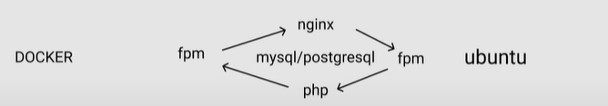

# Docker

`Docker` — программа, позволяющая операционной системе запускать процессы в изолированном окружении на базе специально
созданных образов. (универсальный способ доставки приложений на машины (локальный компьютер или удаленные сервера) и их
запуска в
изолированном окружении)

`Docker Daemon` (демон Докера) - Фоновый сервис, запущенный на хост-машине, который отвечает за создание, запуск и
уничтожение Докер-контейнеров. Демон — это процесс, который запущен на операционной системе, с которой взаимодействует
клиент.

`Docker Client` (клиент Докера) - Утилита командной строки, которая позволяет пользователю взаимодействовать с демоном.
Существуют другие формы клиента, например, Kitematic, с графическим интерфейсом.

`Docker Hub` - Регистр Докер-образов. Грубо говоря, архив всех доступных образов. Если нужно, то можно содержать
собственный регистр и использовать его для получения образов.

`docker version` — показывает техническую информацию о самом Docker. Как о клиенте, так и о сервере.

`docker login` — авторизует пользователя в реестре Docker.

---

## Содержание

1. [Образ](#образ)
2. [Контейнер](#контейнер)
3. [Запуск первой программы в Docker](#запуск-первой-программы-в-docker)
4. [Подготовка собственного образа (Dockerfile)](#подготовка-собственного-образа-dockerfile)
5. [Структура Dockerfile](#структура-dockerfile)
6. [Многоэтапные (multi-stage builds) сборки](#многоэтапные-multi-stage-builds-сборки)
6. [Создания контейнера (docker-compose.yml)](#создания-контейнера-docker-composeyml)
7. [Тома Docker](#тома-docker)
8. [Сети](#сети)
9. [.dockerignore](#dockerignore)
10. [Примеры проектов](#примеры-проектов)

---

[Настройка LEMP сервера с помощью docker для простых проектов. Часть первая: База](https://habr.com/ru/company/nixys/blog/661443/)

[Dockerfile, установка модулей в php](https://habr.com/ru/company/nixys/blog/663512/)

[Образы и контейнеры Docker в картинках](https://habr.com/ru/post/272145/)

---

## Образ

`Образ` (Image) — это слепок файловой системы, в который "упаковано" что-то, ради чего мы используем Докер — например,
PostgreSQL, nginx или вообще наше приложение. Образ можно определить как «сущность» или «общий вид» (union view) стека
слоев только для чтения. Важно то, что они доступны только для чтения (иммутабельны), а все изменения происходят в
верхнем слое стека.

Команды связанные с Изображением / Образом:

`docker images` - Список образов, уже скачанных на компьютер, отвечает за отображение в терминале дополнительной
информации.

- `REPOSITORY` — это репозитория, в котором хранится образ.
- `TAG` — привязанный к нему тег (прописывается в конце команды после двоеточия. Например, docker image build
  moy_repositoriy/testing_timeweb:host.
- `IMAGE ID` — код образа, используемый вместо имени.
- `CREATED` — срок жизни. Показывает, как давно был создан образ. Неделю назад, 12 часов назад и т.п. SIZE —
  пространство,
  которое образ занимает на диске.

```
REPOSITORY     TAG       IMAGE ID       CREATED        SIZE 
docker_nginx   latest    289a2375a168   18 hours ago   142MB
php            8.1-fpm   5878ca832449   10 days ago    450MB
```

`docker build -t name_img:exс /folder` - создание `images`, создание образа, где будет брать Dockerfile, путь чаще всего
просто точка `.`
(test_app - <имя вашего пользователя>)

- `:latest` - по умолчанию
- `:exс` - может быть что угодно
- `-t` — название образа, который будет получен после билда
- `latest` - по умолчанию
- `exс` - может быть что угодно
- `-f` - название Dockerfile, который будет использоваться для сборки образ
- `-no-cache` - Не использовать кеш при построении образа (используеться когда нужно перестроить контейнер с помощью той
  же команды, а он использует кеш прошлой сборки)

`docker history IMAGE_ID` — показывает каждый слой образа в ретроспективе, отображая ряд полезных сведений.

`docker inspect IMAGE_ID` - Возврат низкоуровневой информации об объектах Docker

`docker rmi python` - удаление образа (images). Если в Докере присутствует хоть один контейнер из удаляемого образа, то
Докер не даст его удалить. Если вы все же хотите удалить и образ и все контейнеры, связанные с ним,
используйте флаг `-f`.

`docker image rm $(docker images -a -q)` - удалить все локальные образы, обнаруженные в системе

`docker image prune 22342rw24c` - удаляет неиспользованные изобржения для контейнера

`docker exec app_nginx` `nginx - s reload`  - не входя bash | команды для nginx

`docker push halon/22342rw24c:latest` - залить образ в реестр

`docker pull halon/22342rw24c:latest` - загружает готовый образ с необходимыми для работы параметрами. (без run)

`docker save -o /backup/docker/image_name.tar IMAGE_ID` - создаем архив контейнера <container image> в файл

`docker load -i image_name.tar` - восстанавливает образ

[⏏ К содержанию](#содержание)

## Контейнер

`Контейнер` (Container), упрощенно, это процесс операционной системы, подключенный к образу, то есть его файловой
системе из него. Кроме того, контейнер изолирован от внешней среды и живет в своем окружении. В этом смысле, он похож на
обычную виртуальную машину, но в отличие от нее гораздо более легковесный и зависимый от основной операционной системы.

Вид стека такое же как и в образе кроме того, что верхний слой доступен для записи.

Контейнер определяет лишь слой для записи наверху образа (стека слоев для чтения). Он не запущен.

Каждый запущенный контейнер — атомарный сервис. Другими словами каждый контейнер представляет собой ровно одну
программу, будь то веб-сервер или приложение.

Команды связанные с Контейнером:

`docker ps` - Просмотреть список запущенных контейнеров и информацию о них

- `-a` - вывести список всех контейнеров, в том числе и остановленных
- `-q` - для отображения списка, выводит только ID

`docker create image_id` - создает новый контейнер из указанного образа, не запуская его.

`docker run -t image_id:latest` - Запуск и сразу включит контейнер с флагом и с именем (каждый раз создается новый
контейнер)

- `-p` - позволяет описывать, как и какой порт выставить наружу.
- `-t` — предоставляет доступ к терминалу внутри контейнера.
- `-i` — делает возможным взаимодействие с терминалом внутри контейнера.
- `-d` — запуск контейнер в фоновом режиме. Это позволяет использовать терминал, из которого запущен контейнер, для
  выполнения других команд во время работы контейнера.
- `--rm` — автоматическое удаление контейнера после завершения его работы
- `--name` - Присвоить имя контейнеру
- `-v` - монтирует текущий рабочий каталог в контейнер.

Когда мы выполняли команду `docker run nginx`, то на самом деле выполнялась команда `docker run nginx:latest`. То есть
мы не просто скачиваем образ nginx, а скачиваем его конкретную версию

`docker run -d -p 8000:3000 --name names_cont --rm image_id:2.0` - 3000 порт внутри докера, 8000 для локального
применения (3000
порт контейнера, 8000 - внешний порт)

- `CONTAINER_ID` — идентификатор контейнера. Так же, как и в git, используется сокращенная запись хеша
- `IMAGE` — имя образа, из которого был поднят контейнер. Если не указан тег, то подразумевается latest
- `COMMAND` — команда, которая выполнилась на самом деле при старте контейнера
- `CREATED` — время создания контейнера
- `STATUS` — текущее состояние
- `PORTS` — проброс портов (0.0.0.0 - любой адрес)
- `NAMES` — псевдоним, докер позволяет кроме идентификатора иметь имя. Так гораздо проще обращаться с контейнером. Если
  при
  создании контейнера имя не указано, то Докер самостоятельно его придумывает.

```
CONTAINER ID   IMAGE     COMMAND                  CREATED          STATUS          PORTS                  NAMES
e77764b94408   nginx     "/docker-entrypoint.…"   28 seconds ago   Up 27 seconds   0.0.0.0:8057->80/tcp   my_nginx
```

`docker exec -it container_id <command>` - запускает внутри новую команду в работающем контейнере.

- `-it` разрешает прием ввода от пользователя к процессу, а также вывод в терминал как результата выполнения
  процесса, так и сообщений об ошибках.

`docker inspect container_id` - Информация о контейнере

`docker stats container_id` - выводит информацию о том, сколько ресурсов потребляют запущенные контейнеры

`docker start my_container` - Запустить один или несколько остановленных контейнеров

`docker stop container_id` - Остановить контейнер

`docker stop $(docker ps -a -q)` - Остановить все запущенные

`docker restart container_id` - перезагрузить контейнера

`docker rm container_id` - Для удаления контейнера (удалить и образ и все контейнеры, связанные с ним, используйте
флаг -f)

`docker rm $(docker ps -qa)` - Если нужно удалить все контейнеры

`docker kill 431a3b3fc24b` - удаление, для остановки запущенного контейнера

`docker <system|container|image|volume|network> prune` - Удалить все не связанные с контейнерами ресурсы (образы,
контейнеры, тома и сети, освобождает память)

`docker system prune -a` - выполняет некую чистку, удалив из системы контейнеры, которые уже не используются, ненужные
сети
и образы без имен и меток.

- `-a` -Удалите все неиспользуемые изображения, а не только висящие.

`docker logs container_id` - вывод логов

`docker-compose ps` - Список контейнеров запущенных (проверяет наличие docker-compose.yml)

[⏏ К содержанию](#содержание)

## Запуск первой программы в Docker

[docs: Лучшие практики для написания Dockerfiles](https://docs.docker.com/develop/develop-images/dockerfile_best-practices/)

```dockerfile
FROM php:8.1-cli

RUN apt-get update && ... \
    # расширения

COPY . /usr/src/myapp

WORKDIR /usr/src/myapp

CMD [ "php", "./index.php" ]

$ docker build . -t my-img:latest
$ docker run -it --rm --name my_run my_img # my_run может быть только один
```

```php
# docker run <имя образа> <команда> <параметры если есть>
docker run nginx cat /etc/nginx/nginx.conf
```

`docker run -it -v $HOME/.bash_history:/root/.bash_history ubuntu bash` -
Вот как можно запустить баш сессию из образа Ubuntu, подключив туда историю команд с основной файловой системы.

`docker run --user $(id -u) -it -w /out -v 'pwd':/out node npm init fastify` - Эта команда создаст шаблон приложения в
директории /out.

Что делает docker run?
Согласно документации API-клиента Docker, в установленном порядке выполняются следующие действия.

1. Консоль: выполняет команду `docker run hello-world`.
2. Docker client (CLI): получает команду и выполняет действия на ее основе.
3. Сервер Docker: связывается с CLI, чтобы выдать клиенту из кэша образов (Image Cache) нужный образ с названием
   hello-world. Если такого образа нет, то сервер Docker связывается с хабом Docker, где скачивает образ с указанным
   именем.
4. Docker Hub: хаб Docker получает запрос от сервера Docker на загрузку конкретного файла образа из общедоступного
   хранилища.
5. Сервер Docker: снова ищет образ в разделе “Image Cache”, затем создает контейнер — экземпляр образа hello-world.
6. Контейнер Docker: согласно первоначальным установкам из образа, в контейнере запускается простая программа
   hello-world.
7. Консоль: в результате успешного выполнения всех вышеизложенных этапов отобразит информацию со скриншота.

[⏏ К содержанию](#содержание)

## Подготовка собственного образа (Dockerfile)

Основной файл, хранящий все инструкции. Каждый Dockerfile одинаково структурирован. Чтобы создать dockerfile для
пользовательского образа необходимо указать:

1. Базовый образ.
2. Все зависимости и условия запуска программы.
3. Команду для запуска программы при старте контейнера.

Как же создать образ Docker?

1. Сначала напишите `Dockerfile`.
2. Затем выполните команду `docker build .` (будет искать Dockerfile в текущей директории)
3. Теперь запустите образ командой `docker run image_id`.

`docker build -t test_app:exс /folder` - создание `images`, создание образа, где будет брать Dockerfile, корень
приложения `.`

`docker run name_img:2.0.0` - Создание контейнера после создания образа

При изменении в коде, нужно поменять имя и перезапустить (создать новый контейнер c именем имя_образа:2.0.0 ), при этом
контейнер `name_img:latest` будет не иметь те изменения.
Можно перезаписать версию образа добавив такое же тэг.

`docker build -t имя_пользователя/репозиторий/name_imgа:версия . `

Теперь, чтобы загрузить образ в `Docker Hub`, мы должны дать ему правильное имя. По соглашению, часть имени
Docker-образа до символа `/`, должна совпадать с именем вашего пользователя Docker Hub. Чтобы так сделать, вам
необходимо запустить команду сборки еще раз:

`docker push имя_пользователя/name_imgа:версия` - По умолчанию отправляется тег latest

[⏏ К содержанию](#содержание)

## Структура Dockerfile

```dockerfile
# основной образ
FROM node:18

WORKDIR /app

# такой порядок обусловлен тем что когда будем пересобирать то
# если nodu не был изменен то будет браться из кэша
COPY package.json /app  

RUN npm install # когда собирается 

# скопирует все сущности которые лежат в корне либо
# (./app, но мы уже зашли в нее с помощью WORKDIR)
COPY . . 

# создание переменной
ENV PORT 3000 
# необязательный
EXPOSE $POST 

 # файлы для работы с приложением, которые не будут удаляться 
VOLUME [ "/app/data" ] 

# каждый раз когда запускаем этот образ процесс будет выполняться в контейнере
CMD [ "node", "app.js" ] 
 # cоздаем том для хранения данных
VOLUME /my_volume
```

Инструкции подробнее:

1. `FROM` — задает образ, чья файловая система берется за основу.

2. `LABEL` — описывает метаданные.Они лишь содержат в себе полезную информацию об образе Docker. Например — сведения о
   том, кто создал и поддерживает образ.

3. `ENV` — задает переменные окружения
   В большинстве же ситуаций, переменные окружения передаются снаружи для конкретного запуска:
   `docker run -it -p 3000:3000 -e NODE_ENV=production hexlet/docker-fastify-example`

4. `ARG` — позволяет задать переменную, значение которой можно передать из командной строки в образ во время его сборки.
   ARG-переменные недоступны во время выполнения контейнера. Однако ARG-переменные можно использовать для задания
   значений по умолчанию для ENV-переменных из командной строки в процессе сборки образа. Можно задать переменную
   в `docker-compose.yml`

5. `RUN` — выполняет команду и создаёт слой образа. Используется для установки в контейнер пакетов. Команда RUN
   выполняет переданную строчку в терминале от пользователя root. RUN выполняется в не интерактивном режиме, это значит,
   что если выполняемая команда запросит пользовательский ввод, например разрешение на установку чего-либо, то мы не
   сможем выбрать ответ yes. Поэтому все команды в RUN запускают в неинтерактивном режиме:

- `docker-php-ext-install` - установка модуля.
- `docker-php-ext-configure` - конфигурация модуля.
- `docker-php-ext-enable` - включение модуля.
- `pecl install` - установка модулей с помощью pecl.

```dockerfile
# -q - ставить автоматически не задавая вопросов
RUN apt-get install -q curl

RUN apt-get update \
    && apt-get install -y \
    libmagickwand-dev \ ...
```

6. `WORKDIR` — задает рабочий каталог (автоматически создает директорию, если ее еще нет), относительно которого
   выполняются
   все действия во время формирования образа и при
   входе в контейнер:

```bash
docker run -it hexlet/devops-fastify-app bash

root@02d29c66ea06:/app# # мы оказались внутри /app
```

7. `COPY` — копирует файлы и директории с хост-машины внутрь Docker-образа (копирует в контейнер файлы и папки). Она
   принимает два параметра: первый — что
   копируем, второй — куда копируем и под каким именем. Второй параметр может принимать три варианта:

- Абсолютный путь, копирование происходит ровно по нему (`COPY test.txt /absoluteDir/`)
- Относительный путь, копирование происходит относительно установленной рабочей директории WORKDIR. (`COPY test.txt
  relativeDir/`)
- `.` файл или директория копируется как есть в рабочую директорию

```dockerfile
COPY package.json .
# Аналогично
COPY package.json package.json
# Копируем код из локального контекста в рабочую директорию образа
COPY . .
```

9. `ADD` — копирует файлы и папки в контейнер, может распаковывать локальные .tar-файлы. Основное отличие от COPY, ADD
   умеет скачивать файлы и разворачивать архивы.

10. `CMD` — задает команду, которая выполняется при запуске контейнера по умолчанию. Она используется только в том
    случае,
    если контейнер был запущен без указания команды. В одном файле Dockerfile может присутствовать лишь одна инструкция
    CMD

```dockerfile
# Используется CMD
docker run -it hexlet/docker-fastify-example # npm start

# CMD не используется, так как явно указан bash
docker run -it hexlet/docker-fastify-example bash

CMD ["executable","param1","param2"]
```

10. `ENTRYPOINT` — позволяет задавать команду с аргументами, которая должна выполняться при запуске контейнера. Она
    похожа на команду CMD, но параметры, задаваемые в ENTRYPOINT, не перезаписываются в том случае, если контейнер
    запускают с параметрами командной строки.

```dockerfile
ENTRYPOINT ["executable", "param1", "param2"]
```

В документации к Docker есть несколько рекомендаций, касающихся того, какую инструкцию, CMD или ENTRYPOINT, стоит
выбрать в качестве инструмента для выполнения команд при запуске контейнера:

- Если при каждом запуске контейнера нужно выполнять одну и ту же команду — используйте ENTRYPOINT.
- Если контейнер будет использоваться в роли приложения — используйте ENTRYPOINT.
- Если вы знаете, что при запуске контейнера вам понадобится передавать ему аргументы, которые могут перезаписывать
  аргументы, указанные в Dockerfile, используйте CMD

11. `EXPOSE` — указывает на то, какие порты планируется открыть для того, чтобы через них можно было бы связаться с
    работающим контейнером. Эта инструкция не открывает порты. Она, скорее, играет роль документации к образу, средством
    общения того, кто собирает образ, и того, кто запускает контейнер.

12. `VOLUME` — позволяет указать место, которое контейнер будет использовать для постоянного хранения файлов и для
    работы
    с такими файлами.

## Многоэтапные (multi-stage builds) сборки

```dockerfile
FROM golang:latest
COPY . .
RUN go test && go build ./src/main.go

$ docker image build -t hello_world:build .
```

Если посмотреть метаданные образа: `docker image inspect hello_world:build` то видно, что он состоит из 6 отдельных
слоев
и занимает около 800MB, получили куча артефактов сборки. И это только Hello World, а какой размер может быть у реального
приложение можно только
представить.

Так же каждая инструкция в Dockerfile добавляет отдельный слой и необходимо очистить этот слой от всех лишних
артефактов, перед тем как добавить новый слой.

Практикой является отделение образа для сборки от образа для запуска, но этот подход рутинный поэтому для упрощения
процесса появился build-stages внутри Dockerfile.

Теперь отдельные Dockerfile'ы для билда перестали быть нужны, так как появилась возможность разделять стадии сборки в
одном Dockerfile.

```dockerfile
# Стадия сборки "build-env"
FROM golang:1.8.1-alpine AS build-env
# Устанавливаем зависимости, необходимые для сборки
RUN apk add --no-cache \
    git \
    make
ADD . /go/src/github.com/username/project
WORKDIR /go/src/github.com/username/project
# Запускаем сборку
RUN make build

# -----------------------------------------------------------------

# Стадия подготовки image к бою
FROM alpine:3.5
# Копируем артефакт сборки из стадии "build-env" в указанный файл
COPY --from=build-env /go/src/github.com/username/project/bin/service /usr/local/bin/service
EXPOSE 65122
CMD ["service"]
```

<details>
<summary>Mожно использовать несколько стадий сборки, например если вы собираете отдельно бекенд и фронтенд</summary>

```dockerfile
# Стадия сборки "build-env"
FROM golang:1.8.1-alpine AS build-env
ADD . /go/src/github.com/username/project
WORKDIR /go/src/github.com/username/project
# Запускаем сборку
RUN make build

# --------
# Вторая стадия сборки "build-second"
FROM build-env AS build-second
RUN touch /newfile
RUN echo "123" > /newfile

# --------
# Стадия сборки frontend "build-front"
FROM node:alpine AS build-front # Каждая инструкция FROM обнуляет все предыдущие команды.
ENV PROJECT_PATH /app
ADD . $PROJECT_PATH
WORKDIR $PROJECT_PATH
RUN npm run build

# --------
# Стадия подготовки image к бою
FROM alpine:3.5  
# Копируем артефакт сборки из стадии "build-env" в указанный файл
COPY --from=build-env /go/src/github.com/username/project/bin/service /usr/local/bin/service
# Копируем артефакт сборки из стадии "build-front" в указанную директорию
COPY --from=build-front /app/public /app/static
EXPOSE 65122
CMD ["service"]
```

</details>

[⏏ К содержанию](#содержание)

## Создания контейнера (docker-compose.yml)

`Docker Compose` позволяет управлять набором контейнеров, каждый из которых представляет собой один сервис проекта.
Управление включает в себя сборку, запуск с учетом зависимостей и конфигурацию. Конфигурация Docker Compose описывается
в файле docker-compose.yml, лежащем в корне проекта.

`docker-compose build` - Собирает сервисы, описанные в конфигурационных файлах

`docker-compose ps` - Список контейнеров

`docker-compose up` - Запускает собранные сервисы (скачивает)

- `-d` - Запуск контейнеров на фоне с флагом -d
- `--build` - если изменили какие то приложения
- `--abort-on-container-exit` - Если какой-то из сервисов завершит работу, то остальные будут остановлены автоматически
- `--force-recreate` - перечитывает конфигурацию docker-compose.yml и поднимает контейнер с учетом новых параметров в
  docker-compose.yml
- `--no-deps` - Не запускайте связанные службы.

`docker-compose run application make install` - Запустит сервис application и выполнит внутри команду `make install`

`docker-compose run application bash` - А так мы можем запустить сервис и подключиться к нему с помощью bash

`docker-compose exec service_name command` - позволяет выполнить команду в выполняющемся контейнере

`docker-compose run --rm application bash` - Со флагом --rm запускаемые контейнеры будут автоматически удаляться

`docker-compose down` - Останавливает и удаляет все сервисы, которые были запущены с помощью up

`docker-compose stop` - Останавливает, но не удаляет сервисы, запущенные с помощью up

`docker-compose start` - Запустить снова

`docker-compose restart` - Перезапускает все остановленные и запущенные сервисы

`docker-compose logs -f service_name` - журналы сервисов

`docker-compose -f docker-compose.yml config` `ocker-compose config` - проверяет синтаксис файла 

```yml
#Версия схемы, которую мы используем.
# Зависит от установленной версии docker
version: "3"
# Определяем список сервисов — services
# Эти сервисы будут частью нашего приложения
services:

  app: # Имя сервиса
    # путь к файлу Dockerfile, который нужно использовать для создания образа,
    # который позволит запустить сервис.
    build:
      # Контекст для сборки образа,в данном случае, текущая директория
      context: .
      # Имя докерфайла из которого будет собран образ
      # не обязательно что будет называться именно так
      dockerfile: Dockerfile
      # Команда, которая будет выполнена после старта сервиса

      # Использование makfile    
      # command: make start
      # sh вместо, bash потому что он более доступен для большинства образов на основе Unix
      command: >
        sh -c "python manage.py migrate
        && python manage.py run server 0.0.0.0:8000"
      # command: bash -c "..."


    ports: # Проброс портов
      # [порт компьютера]:[порт контейнера]
      - "3000:8000"

    # Перечисляем тома (volumes)
    # Они будут подключены к файловой системе сервиса
    # Например, все что находится в . мы увидим в директории /app
    volumes:
      # Текущая директория пробрасывается в директорию /app внутри контейнера
      - ".:/app"
      # директория-на-хост-машине: директория-в-докере
      - "/tmp:/tmp"
    # Сервис будет запущен, только после старта db
    depends_on:
      - db

  db:
    # Имя образа. Здесь мы используем базу данных Postgres
    image: postgres:latest
    environment:
      # А так задаются переменные окружения
      POSTGRES_PASSWORD: password
    volumes:
      - pgdata:/var/lib/postgresql/data

volumes:
  pgdata:

# -----------------------------------------------------------------
services:
  nginx:
    container_name: nginx-test # имя Docker-контейнера
    build: # создать Docker-образ из DockerFile
      context: . # путь, в контексте которого будет создан Docker-образ
      dockerfile: ./dockerFiles/nginx/Dockerfile # путь до Dockerfile, из которого будет собран Docker-образ
    ports: # проброс портов
      - "80:80"
    networks: # имя сети, к которой будет подключен Docker-контейнер
      - test-network
    depends_on: # эта программа будет запущена только после того, как запустится сервис под именем php-fpm 
      - php-fpm
    volumes: #  монтирование директорий
      - ./:/var/www/hello.dev/

  php-fpm:
    container_name: php-fpm-test
    build:
      context: .
      dockerfile: ./dockerFiles/php-fpm/Dockerfile
    networks:
      - test-network
    volumes:
      - ./:/var/www/hello.dev/

  #   $pdo = new \PDO("pgsql:host=postgres;dbname=postgres", 'postgres', 'mysecretpass');
  #   host=postgres благодаря общей сети test-network     
  postgres:
    container_name: postgres-test
    image: postgres:14.1-alpine # тег Docker-образа из https://hub.docker.com/
    environment:
      postgres_PASSWORD: mysecretpass # переменные окружения, которые использует Docker-контейнер
    networks:
      - test-network

# Как мы объяснили ранее, каждое приложение в Docker-контейнере находится
# в изоляции. networks объединяет все Docker-контейнеры в одну сеть с
# именем test-network, и это позволяет обращаться к нужному контейнеру по его имени.      
networks: # явно объявленные сети
  test-network:
    driver: bridge
```

[Составление спецификации файла](https://docs.docker.com/compose/compose-file/)

[⏏ К содержанию](#содержание)

## Тома Docker

Часто бывает так, что данные нужно хранить и после того, как контейнер прекратит существовать. Для этого нам пригодятся
механизмы постоянного хранения данных.

Существуют два способа, позволяющих сделать срок жизни данных большим срока жизни контейнера. Один из способов
заключается в использовании технологии `bind mount`. При таком подходе к контейнеру можно примонтировать, например,
реально существующую папку. Работать с данными, хранящимися в такой папке, смогут и процессы, находящиеся за пределами
Docker.

Минусы использования технологии `bind mount` заключаются в том, что её использование усложняет резервное копирование
данных, миграцию данных, совместное использование данных несколькими контейнерами. Гораздо лучше для постоянного
хранения данных использовать тома Docker.

`Том` — это файловая система, которая расположена на хост-машине за пределами контейнеров. Созданием и управлением
томами
занимается Docker. Вот основные свойства томов Docker:

- Они представляют собой средства для постоянного хранения информации.
- Они самостоятельны и отделены от контейнеров.
- Ими могут совместно пользоваться разные контейнеры.
- Они позволяют организовать эффективное чтение и запись данных.
- Тома можно размещать на ресурсах удалённого облачного провайдера.
- Их можно шифровать.
- Им можно давать имена.
- Контейнер может организовать заблаговременное наполнение тома данными.
- Они удобны для тестирования.

В Docker существует два способа объявления томов: императивный способ (клиент Docker) и декларативный способ (файл
Docker Compose yaml или Docker Dockerfile).

```yml
  backend:
    image: awesome/backend
    volumes:
      - type: volume
        source: db-data  <--
        target: /data
        volume:
          nocopy: true
      - type: bind
        source: /var/run/postgres/postgres.sock
        target: /var/run/postgres/postgres.sock

  volumes:
    db-data: <--
```

`volumes` — это механизм для хранения данных вне Docker-контейнера, то есть в файловой системе нашей ОС. volumes решает
проблему совместного использования файлов.

В этом примере показан именованный том (db-data), используемый службой backend, и монтирование с привязкой,
определенное для одной службы.

`docker volume create --name my_volume `- Создать самостоятельный том

`docker run -it -v my-volume:/data --name my-container selaworkshops/busybox:latest` - запуск контейнера и смонтировать
папку (если создать my-container-2, то my-volume не изменится)

`docker run -d --name geekflare -v my-volume:/app nginx:latest` - В этом примере команды вы используете том my-volum с
контейнером geekflare.

`docker volume ls` - просмотреть список томов

`docker volume inspect my_volume` - Исследовать конкретный том

`docker volume rm  my_volume` - Удалить том

`docker volume prune` - все тома, которые не используются контейнерами

[⏏ К содержанию](#содержание)

## Сети

`Сеть Docker` – это канал, через который общаются все изолированные контейнеры.

Сеть Docker в основном используется для установления связи между контейнерами Docker и внешним миром через хост-машину,
или вы можете сказать, что это коммуникационный канал, через который все изолированные контейнеры взаимодействуют друг с
другом в различных ситуациях для выполнения необходимых действий.

- `bridge`: это сетевой драйвер по умолчанию для контейнера. Вы используете эту сеть, когда ваше приложение работает в
  автономных контейнерах, то есть несколько контейнеров взаимодействуют с одним и тем же хостом докера.
- `host`: Этот драйвер удаляет сетевую изоляцию между док-контейнерами и док-хостом. Он используется, когда вам не нужна
  сетевая изоляция между хостом и контейнером.
- `overlay`: эта сеть позволяет службам swarm взаимодействовать друг с другом. Он используется, когда контейнеры
  работают на разных хостах Docker или когда службы swarm сформированы из нескольких приложений.
- `None`: этот драйвер отключает все сети.
- `macvlan`: этот драйвер назначает MAC-адрес контейнерам, чтобы они выглядели как физические устройства. Трафик
  направляется между контейнерами через их mac-адреса. Эта сеть используется, когда вы хотите, чтобы контейнеры
  выглядели как физическое устройство, например, при переносе настройки виртуальной машины.

`docker network ls` - проверить все сети

```
NETWORK ID     NAME      DRIVER    SCOPE
d4e8bf6f8416   bridge    bridge    local
29cc202816aa   host      host      local
53ad37e1e626   none      null      local
```
`NETWORK ID` — При создании сети, ей присваивается ID. Так это собственно индификатор сети.
`NAME` — Имя сети. Можно задать произвольное имя.
`DRIVER` — Используемый драйвер для созданной сети.
`SCOPE` — Где используется.

`docker network inspect itisgood_network` - получить все подробности о типе сети

`docker network create --driver overlay  itisgood_network_2` - создать сеть, отличную от моста (bridge), необходимо
указать имя драйвера, отличное от bridge.

`docker network disconnect itisgood_network my_container` - отключить сеть от контейнера, Эта сеть больше не будет
работать с контейнером my_container; поле контейнера будет пустым.

[⏏ К содержанию](#содержание)

## .dockerignore

Он содержит список файлов и папок, в виде имён или шаблонов, которые Docker должен игнорировать в ходе сборки образа.
При запуске команды docker build, инициирующей сборку образа, Docker проверяет папку на наличие в ней файла
.dockerignore

```php
node_modules/
.env
*.sqlite

# Исключайте файлы и каталоги, начинающиеся с temp, из любого подкаталога, который
# находится на два уровня ниже корня. Например, /somedir/subdir/temporary.txt
*/*/temp*
```

[⏏ К содержанию](#содержание)

## Примеры проектов

Файловая система:

```dockerfile 
|- nginx
|   |- nginx.conf
|- public
|   |- index.php
|- docker-compose.yml
|- # Dockerfile НЕТ
```

<details>
<summary>Файлы</summary>

```php
server {

    root /var/www/public;

    location / {
        try_files $uri /index.php;
    }


    location ~ \.php$ {
                try_files $uri =404;
                fastcgi_split_path_info ^(.+\.php)(/.+)$;
                fastcgi_pass php:9000;  // какой файл открыть
                fastcgi_index index.php;  
                include fastcgi_params;
                fastcgi_param SCRIPT_FILENAME $document_root$fastcgi_script_name;
                fastcgi_param PATH_INFO $fastcgi_path_info;
    }
}
```

```yaml
version: '3'

services:

  nginx:
    image: nginx
    volumes:
      - ./:/var/www/
      - ./nginx/:/etc/nginx/conf.d/
    ports:
      - "8056:80"
    container_name: app_nginx
    depends_on:
      - php

  php:
    image: php:8.1-fpm  #<-- php:8.1-cli не работает
    volumes:
      - ./:/var/www/
    container_name: php_fpm

  $ docker-compose up -d
```

</details>

```dockerfile
- nginx
|   |- nginx.conf
|- public
|   |- index.php
|- docker-compose.yml
|- Dockerfile
```

<details>
<summary>Файлы</summary>

```dockerfile
FOM nginx:latest

ADD ./nginx/nginx.conf /etc/nginx/conf.d/default.conf # изменился путь

WORKDIR /app
```

```yaml
version: '3'

services:

  nginx:
    build:
      context: .
      dockerfile: Dockerfile

    volumes:
      - ./:/var/www/
      # - ./nginx/:/etc/nginx/conf.d/
    ports:
      - "8056:80"
    container_name: app_nginx
    depends_on:
      - php

  php:
    image: php:8.1-fpm  #<-- php:8.1-cli не работает
    volumes:
      - ./:/var/www/
    container_name: php_fpm

  $ docker build .
  $ docker-compose up -d
```

</details>

---

Технологический стек для веб разработки




<details>
<summary>Файла 2 файла compose.yml и использование сети</summary>

[https://ru.stackoverflow.com](https://ru.stackoverflow.com/questions/1075125/docker-%D0%BD%D0%B5-%D0%B7%D0%B0%D0%BF%D1%83%D1%81%D0%BA%D0%B0%D0%B5%D1%82-%D0%BA%D0%BE%D0%BD%D1%82%D0%B5%D0%B9%D0%BD%D0%B5%D1%80-php-cli)

```yml
version: '3.5'

services:
  nginx:
    build:
      context: ./Docker
      dockerfile: nginx.docker
    volumes:
      - ./:/var/www/
    depends_on:
      - php-fpm
    ports:
      - "8056:443"
    networks:
      - network

  php-fpm:
    build:
      context: ./Docker
      dockerfile: php-fpm.docker
    volumes:
      - ./:/app
    networks:
      - network
    depends_on:
      - mysql

volumes:
  composer:

#  Основную сложность всегда представляло из себя именно то, как связать друг с другом контейнеры, чтоб они друг 
# друга видели и взаимодействовали
networks:
  network:
    name: my-network
    driver: bridge

  $ docker-compose up -d
```

```yml
# ./cli-compose.yml

version: '3.5'
services:
  php-cli:
    build:
      context: ./Docker
      dockerfile: php-cli.docker
    volumes:
      - ./:/app
      - composer:/root/.composer/cache
    networks:
      - network

volumes:
  composer:
networks:
  network:
    name: my-network
    driver: bridge

  $ docker-compose -f ./cli-compose.yml build
  $ docker-compose -f ./cli-compose.yml run php-cli bash
```

</details>

<details>
<summary>build-stages для php:8.1.5-fpm</summary>

```dockerfile
#FROM php:8.1.5-fpm
#
#WORKDIR /var/www
#
#RUN apt-get update \
#    && apt-get install -y \
#    libmagickwand-dev \
#    libmagickcore-dev \
#    libzip-dev \
#    libwebp-dev
#
#RUN docker-php-ext-install exif \
# && pecl install imagick \
# && docker-php-ext-enable imagick \
# && PHP_OPENSSL=yes \
# && docker-php-ext-install xml \
# && docker-php-ext-install filter \
# && docker-php-ext-install zip \
# && docker-php-ext-install bcmath \
# && docker-php-ext-configure gd --with-freetype --with-jpeg --with-webp \
# && docker-php-ext-install gd \
# && docker-php-ext-install intl
#
#CMD ["php-fpm"]

FROM php:8.1.5-fpm AS builder

ENV PHP_OPENSSL=yes

RUN apt-get update \
    && apt-get install -y \
    libmagickwand-dev \
    libmagickcore-dev \
    libzip-dev \
    libwebp-dev

RUN pecl install imagick \
    && docker-php-ext-install bcmath \
    	exif \
    	filter \
    	intl \
    	xml \
    	zip \
    && docker-php-ext-configure gd --with-freetype --with-jpeg --with-webp \
    && docker-php-ext-install gd


FROM php:8.1.5-fpm

WORKDIR /var/www

COPY --from=builder /usr/local/lib/php/extensions/no-debug-non-zts-20210902/ \
    /usr/local/lib/php/extensions/no-debug-non-zts-20210902/

RUN apt-get update \
    && apt install -y libmagickcore-6.q16-6 libmagickwand-6.q16-6 libzip4 \
    && docker-php-ext-enable bcmath \
    	exif \
    	gd \
    	imagick \
    	intl \
    	zip \
    && rm -rf /var/lib/apt/lists/*

CMD ["php-fpm"]
```

</details>

<details>
<summary>build-stages для php:8.1.5-fpm и 8.2-fpm</summary>

```dockerfile
FOM php:8.1-fpm

# Set Environment Variables
ENV DEBIAN_FRONTEND noninteractive
#
# Installing tools and PHP extentions using "apt", "docker-php", "pecl",
#
# Install "curl", "libmemcached-dev", "libpq-dev", "libjpeg-dev",
#         "libpng-dev", "libfreetype6-dev", "libssl-dev", "libmcrypt-dev",
RUN set -eux; \
    apt-get update; \
    apt-get upgrade -y; \
    apt-get install -y --no-install-recommends \
            curl \
            libmemcached-dev \
            libz-dev \
            libpq-dev \
            libjpeg-dev \
            libpng-dev \
            libfreetype6-dev \
            libssl-dev \
            libwebp-dev \
            libxpm-dev \
            libmcrypt-dev \
            libonig-dev; \
    rm -rf /var/lib/apt/lists/*

RUN set -eux; \
    # Install the PHP pdo_mysql extention
    docker-php-ext-install pdo_mysql; \
    # Install the PHP pdo_pgsql extention
    docker-php-ext-install pdo_pgsql; \
    # Install the PHP gd library
    docker-php-ext-configure gd \
            --prefix=/usr \
            --with-jpeg \
            --with-webp \
            --with-xpm \
            --with-freetype; \
    docker-php-ext-install gd; \
    php -r 'var_dump(gd_info());'
```

</details>

<details>
<summary>docker-compose.yml для wordpress</summary>

https://github.com/pavlenko-at/worlditech

```yml
version: '3.9'

services:
  mysql:
    image: mysql:8.0
    container_name: mysql8
    restart: unless-stopped
    env_file: .env
    volumes:
      - dbfile:/var/lib/mysql
    command: '--default-authentication-plugin=mysql_native_password'
    networks:
      - app

  wp:
    image: wordpress:5.7.0-php8.0-fpm
    container_name: wordpress-5.7.0-php8.0-fpm
    depends_on:
      - mysql
    restart: unless-stopped
    env_file: .env
    environment:
      - WORDPRESS_DB_HOST=mysql:3306
      - WORDPRESS_DB_USER=$MYSQL_USER
      - WORDPRESS_DB_PASSWORD=$MYSQL_PASSWORD
      - WORDPRESS_DB_NAME=$MYSQL_DATABASE
    volumes:
      - www-html:/var/www/html
    networks:
      - app

  nginx:
    image: nginx:1.19.8-alpine
    depends_on:
      - wp
    container_name: nginx-1.19.8-alpine
    restart: unless-stopped
    ports:
      - "80:80"
    volumes:
      - www-html:/var/www/html
      - ./nginx-conf.d:/etc/nginx/conf.d
    networks:
      - app

volumes:
  www-html:
  dbfile:

networks:
  app:
    driver: bridge
```

```php
server {
        listen 80;
        listen [::]:80;

        server_name  north.world-ithech.ru;

        index index.php index.html index.htm;

        root /var/www/html;

        location / {
                try_files $uri $uri/ /index.php$is_args$args;
        }

        location ~ \.php$ {
                try_files $uri =404;
                fastcgi_split_path_info ^(.+\.php)(/.+)$;
                fastcgi_pass wp:9000;
                fastcgi_index index.php;
                include fastcgi_params;
                fastcgi_param SCRIPT_FILENAME $document_root$fastcgi_script_name;
                fastcgi_param PATH_INFO $fastcgi_path_info;
        }

        location ~ /\.ht {
                deny all;
        }

        location = /favicon.ico {
                log_not_found off;
        }
        location = /robots.txt {
                log_not_found off;
        }
        location ~* \.(css|gif|ico|jpeg|jpg|js|png)$ {
                expires max;
                log_not_found off;
        }
}
```
```dotenv
MYSQL_ROOT_PASSWORD=765843
MYSQL_USER=wp_db_user
MYSQL_PASSWORD=1234
MYSQL_DATABASE=wp_db
```

</details>

[Установка и настройка Laravel с помощью Docker Compose ](https://www.digitalocean.com/community/tutorials/how-to-install-and-set-up-laravel-with-docker-compose-on-ubuntu-20-04-ru)

[Docker для локальной php разработки](https://verstaem.com/devops/docker-php-development/)

[⏏ К содержанию](#содержание)