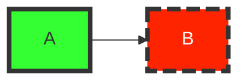
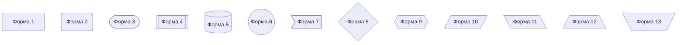
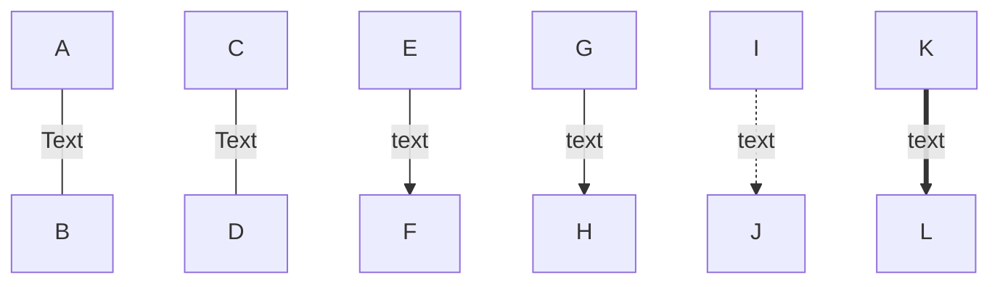
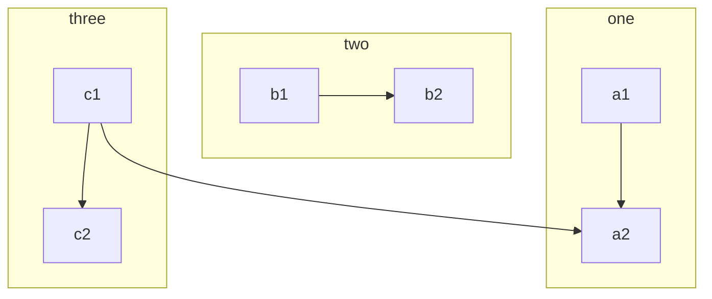
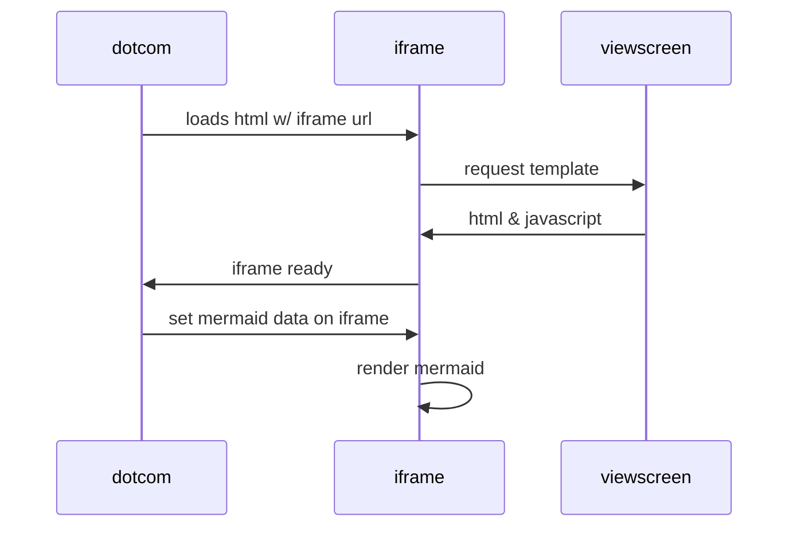

Такая таблица с использованием .yml формата может находиться только в начале файла, cинтаксис будет в разделе таблицы.
Используется в генераторах документации, такие как Hugo.

# Markdown

---

## Содержание

1. [Введение](#введение)
2. [Параграфы и разрывы строк](#параграфы-и-разрывы-строк)
3. [Оформление текста](#оформление-текста)
4. [Добавление свернутого раздела](#добавление-свернутого-раздела)
5. [Выравнивание текста](#выравнивание-текста)
6. [Комментарии](#комментарии)
7. [Заголовки](#заголовки)
8. [Цитаты](#цитаты)
9. [Блоки-кода](#блоки-кода)
10. [Горизонтальные (разделительные) линии](#горизонтальные-разделительные-линии)
11. [Вставка изображения или ссылки](#вставка-изображения-или-ссылки)
12. [Бейджики](#бейджики)
13. [Ссылки](#ссылки)
14. [Таблица](#таблица)
15. [Формулы](#формулы)
15. [Диаграммы](#диаграммы)
16. [Emoji](#emoji)
17. [Дополнительные элементы](#дополнительные-элементы)
18. [Сноски](#сноски)

---

## Введение

Git поддерживает много расширений для документирования проекта, но чаще всего используется только несколько.

- `AsciiDoc .adoc` - есть возможность использования математические обозначения
- `Markdown`

Расширение `.md` — это сокращение от слова markdown. Часто используемая язык разметки. Его используют (как и
язык разметки HTML) для нормального отображения документов.

Не забываете в нем можно использовать HTML теги.

У Markdown есть [оригинальная спецификация](https://daringfireball.net/projects/markdown/basics) от одного из создателей
языка — Джона Грубера. К сожалению, она не всегда однозначно описывает синтаксис, из-за чего многие конвертеры Markdown
работают по-разному. Чтобы исправить эту ситуацию, группа разработчиков «поклонников Markdown» создала CommonMark —
спецификацию, которая описывает многие частные случаи, и эталонную реализацию парсера Markdown на JS.

Для вставки символов внутрь тегов воспользуетесь [HTML-кодом символов](https://symbl.cc/ru/html-entities/) - мнемоники

## Параграфы и разрывы строк

Для того чтобы вставить видимый перенос строки (элемент `<br/>`) необходимо окончить строку двумя пробелами и нажатием
клавиши «Enter»

## Оформление текста

```markdown
~~Зачеркнутый текст~~

**Жирный текст (bold)**

*Наклонный текст (italic)*

***Жирный наклонный текст (bold italic)***

Это `слово` будет выделено

<sup>Надстрочный текст</sup>

<sub>Подстрочный текст</sub>

<span style="color: blue">About us</span>
```

Результат:

---

~~Зачеркнутый текст~~

**Жирный текст (bold)**

*Наклонный текст (italic)*

***Жирный наклонный текст (bold italic)***

Это `слово` будет выделено

<sup>Надстрочный текст</sup>какой то текст

<sub>Подстрочный текст</sub>какой то текст

<span style="color: blue">About us</span> <-- не отображается
---

## Добавление свернутого раздела

```markdown
<details>
<summary>My top THINGS-TO-RANK</summary>

- ...

</details>
// <details open> - чтобы атоматически был открытым
```

Резульат:

<details>
<summary>Раздел</summary>

- пункт 1
- пункт 2

</details>

## Выравнивание текста

```markdown
<p align="center">Выравнивание по центру.</p>
<p align="left">Выравнивание по левому краю.</p>
<p align="right">Выравнивание по правому краю.</p>
<p align="justify">Выравнивание по ширине.</p>
```

Резульат:

---

<p align="center">Выравнивание по центру.</p>
<p align="left">Выравнивание по левому краю.</p>
<p align="right">Выравнивание по правому краю.</p>
<p align="justify">Выравнивание по ширине.</p>

---

## Комментарии

```markdown
<!-- комментарий  --> 

[//]: # (комментарий)
```

## Заголовки

```markdown
Заголовок первого уровня
========================
Заголовок второго уровня
-------------------------
```

```markdown
# Заголовок первого уровня

### Заголовок третьего уровня

#### Заголовок четвертого уровня

##### Заголовок пятого уровня

###### Заголовок шестого уровня
```

Результат:

---

# Заголовок первого уровня

### Заголовок третьего уровня

#### Заголовок четвертого уровня

##### Заголовок пятого уровня

###### Заголовок шестого уровня

---

## Цитаты

```markdown
> Первый уровень цитирования
>> Второй уровень цитирования
>>> Третий уровень цитирования
>
>Первый уровень цитирования
```

Резульат:

---
> Первый уровень цитирования
>> Второй уровень цитирования
>>> Третий уровень цитирования
>
>Первый уровень цитирования
>
---

## Списки

```markdown
- Пункт 1

* Проводник

+ Проводник

- Уровень списка 1.
    - Уровень списка 2.
        - Уровень списка 3. 
```

Результат:

---

- Пункт 1

* Пункт 1

+ Пункт 1

- Уровень списка 1.
    - Уровень списка 2.
        - Уровень списка 3.

---

## Блоки кода

```php
print_r("test");
```

```diff
--- filename.orig
+++ filename
@@ -line number,7 +line number,7 @@
     good line of code #1
     good line of code #2
-    the original line with a wrong coding style
+    the line wrong coding style that has been corrected
     good line of code #3
     good line of code #4
```

## Горизонтальные (разделительные) линии

```markdown
---

***
```

## Вставка изображения

```markdown

[](ссылка на страничку)

[PlDb]: <http://путь/к/изображению.jpg>

[id]: ../assets/pattern1.png  <-- использовать как переменную
....текст....
![Альтернативный текст][id]  <-- а тут она вызывается

В сноске:  
![alt-текст][logo]

[logo]: https://.... "Текст заголовка"
```

```html

<figure>
    
    <figcaption>какие то коты</figcaption>
</figure>

// изменить размер фотографии
<p>
    
</p>
```

## Ссылки

```markdown
[ссылка с title](http://example.com/ "Необязательная подсказка")

[Введение](#введение)

[Pattern](/theory/Pattern.md) <-- относительная ссылка (можно ходить по репозиторию)

[Pattern](/../theory/Pattern.md)

[Ссылка со сноской][id]
[id]: https://www.mozilla.org

Можно вставить ссылку в конце файла [текст ссылки]
....текст....
[текст ссылки]: http://www.yandex.ru

[⏏ К содержанию](#содержание)
```

[⏏ К содержанию](#содержание)

## Бейджики

```markdown
Language: 
```

Language: 

Сложно вставлять свои или готовые бейджик. Источник:  https://shields.io/category/build

## Таблица

```markdown
| LEFT | CENTER | RIGHT |
|----------------|:---------:|----------------:|  <-- двоеточие
| По левому краю | По центру| По правому краю | определеяет позицию
| текст | текст | текст |

```

Результат:

| LEFT           |         CENTER         |           RIGHT |
|----------------|:----------------------:|----------------:|
| По левому краю | По центру лишний текст | По правому краю |
| текст          |         текст          |           текст |

Внимание:
Если в тексте таблицы нужно использовать символ "вертикальная черта - `|`", то в место него необходимо написать замену
на комбинацию HTML-кода* `&#124;`, это нужно для того, что бы таблица не потеряла ориентации.

```html 
<table>
    <thead>
        <tr>
            <th colspan="2">The table header</th>
        </tr>
    </thead>
    <tbody>
        <tr>
            <td>The table body</td>
            <td>with two columns</td>
        </tr>
    </tbody>
</table>
```

<table>
    <thead>
        <tr>
            <th colspan="2">The table header</th>
        </tr>
    </thead>
    <tbody>
        <tr>
            <td>The table body</td>
            <td>with two columns</td>
        </tr>
    </tbody>
</table>


Синтаксис той таблицы, что в начале файла

```
---
title: Table Filter Example
table-templates:
    card:
    orientation: horizontal
    series:
    - title: Name
      id: name
    - title: Age
      id: age
    - title: Company
      id: company
    - title: Position
      id: position
    classes:
    - card
    - horizontal
---
```

## Формулы

Для визуализации формул GitHub использует популярную библиотеку MathJax. Для визуализации формул пользователю следует
использовать ключевые символы в виде `$` или `$$`. Формулы следует записывать в формате TeX
или [LaTeX](https://ru.wikibooks.org/wiki/%D0%9C%D0%B0%D1%82%D0%B5%D0%BC%D0%B0%D1%82%D0%B8%D1%87%D0%B5%D1%81%D0%BA%D0%B8%D0%B5_%D1%84%D0%BE%D1%80%D0%BC%D1%83%D0%BB%D1%8B_%D0%B2_LaTeX)
.

```
$$\frac{n!}{k!(n-k)!} = \binom{n}{k}$$
```

$$\frac{n!}{k!(n-k)!} = \binom{n}{k}$$

```
**The Cauchy-Schwarz Inequality**
$$\left( \sum_{k=1}^n a_k b_k \right)^2 \leq \left( \sum_{k=1}^n a_k^2 \right) \left( \sum_{k=1}^n b_k^2 \right)$$
```

**The Cauchy-Schwarz Inequality**
$$\left( \sum_{k=1}^n a_k b_k \right)^2 \leq \left( \sum_{k=1}^n a_k^2 \right) \left( \sum_{k=1}^n b_k^2 \right)$$

```


```


## Диаграммы

<details>
<summary>Рисуем диаграммы : (https://habr.com/ru/post/652867/)</summary>

- fill — заливка;
- stroke — цвет границы;
- stroke-width — толщина границы;
- color — цвет текста;
- stroke-dasharray — пунктирная граница.

```
flowchart LR
  classDef class1 fill:#3f3,stroke:#333,stroke-width:4px
  classDef class2 fill:#ff2400,stroke:#333,stroke-width:4px,color:#fff,stroke-dasharray: 12 5

  A:::class1 --> B:::class2
```



```
    ```mermaid
      graph TD;
          A-->B;
          A-->C;
          B-->D;
          C-->D;
    ```
```


```
  flowchart TB
    node1[Форма 1]  
    node2(Форма 2)
    node3([Форма 3])
    node4[[Форма 4]]
    node5[(Форма 5)]
    node6((Форма 6))
    node7>Форма 7]
    node8{Форма 8}
    node9{{Форма 9}}
    node10[/Форма 10/]
    node11[\Форма 11\]
    node12[/Форма 12\]
    node13[\Форма 13/]
```



```
flowchart TD
  A-- Text ---B
  C---|Text|D
  E-->|text|F
  G-- text -->H
  I-. text .-> J
  K == text ==> L
```



```
flowchart TB
    c1-->a2
    subgraph one
    a1-->a2
    end
    subgraph two
    b1-->b2
    end
    subgraph three
    c1-->c2
    end
```



```
    ```mermaid
    sequenceDiagram
        participant dotcom
        participant iframe
        participant viewscreen
        dotcom->>iframe: loads html w/ iframe url
        iframe->>viewscreen: request template
        viewscreen->>iframe: html & javascript
        iframe->>dotcom: iframe ready
        dotcom->>iframe: set mermaid data on iframe
        iframe->>iframe: render mermaid
    ```

```



</details>

Как пример изобразить диаграмму c помощью кода ASCII.

```
  +--------+   +-------+    +-------+
  |        | --+ ditaa +--> |       |
  |  Text  |   +-------+    |diagram|
  |Document|   |!magic!|    |       |
  |     {d}|   |       |    |       |
  +---+----+   +-------+    +-------+
      :                         ^
      |       Lots of work      |
      +-------------------------+
```

Пример Graph::Easy

```
+ - - - - - - - - - - - - - - - - - - - +
  ' Backends :                            '
  '                                       '
  '                data                   '
  '   +----------------------+            '
  '   v                      |            '
+---------------+             +---------------+  facts      ' +------------+         +------------+ '
|               |  facts      |               |  catalogs   ' |  PuppetDB  |  data   | PostgreSQL | '
|               | ~~~~~~~~~~> |               | ~~~~~~~~~~> ' |            | ------> |            | '
|               |             |               |             ' +------------+         +------------+ '
| Puppet Agents |             |               |             '                                       '
|               |             | Puppet Master |             + - - - - - - - - - - - - - - - - - - - +
|               |  policies   |               |                 |
|               | <---------- |               |                 | REST API
+---------------+             |               |                 v
                              |               |  modules      +------------+
                              |               | <----------   | Developers |
                              +---------------+               +------------+
```

`asciitable` - он предлагает несколько реализаций текстовой таблицы, первоначально используя символы ASCII и UTF-8 для
границ.

```
    ┌──────────────────────────────────────────────────────────────────────────┐
    │ Table Heading                                                            │
    ├──────────────────┬──────────────────┬──────────────────┬─────────────────┤
    │ first row (col1) │ with some        │ and more         │ even more       │
    │                  │ information      │ information      │                 │
    ├──────────────────┼──────────────────┼──────────────────┼─────────────────┤
    │ second row       │ with some        │ and more         │ even more       │
    │ (col1)           │ information      │ information      │                 │
    │                  │ (col2)           │ (col3)           │                 │
    └──────────────────┴──────────────────┴──────────────────┴─────────────────┘
```

## Emoji

```markdown
:white_check_mark: Это уже сделано
:negative_squared_cross_mark: Я не буду это делать
:black_square_button: делать или не делать, вот в чем вопрос?

- [X] Придумать внешний вид резюме
- [ ] Написать основные категории
```

Полный список разметки смайликов github markdown https://gist.github.com/rxaviers/7360908

## ❗❓⁉❕💡📌👀🐞👇👆📢💻🖥💾🔒📚📰📒📃📜📄📑📦✏📝⏳📋

Результат:

:white_check_mark: Это уже сделано

:negative_squared_cross_mark: Я не буду это делать

:black_square_button: делать или не делать, вот в чем вопрос?

- [X] Придумать внешний вид резюме
- [ ] Написать основные категории

```
> **Warning**: This is a waring

> **Note** : This is a note
```

> **Warning**: This is a waring

> **Note** : This is a note

## Дополнительные элементы

Изображает прогресс

```html

<progress value="63" max="100">
</progress>
```

<progress value="63" max="100">
</progress>

Имитация клавиатуры

```html

<pre>
    <kbd>Ctrl</kbd>+<kbd>Shift</kbd>+<kbd>Esc</kbd> - Вызов диспетчера задач.
</pre>
```

<pre>
    <kbd>Ctrl</kbd>+<kbd>Shift</kbd>+<kbd>Esc</kbd> - Вызов диспетчера задач.
</pre>

## Сноски

Всегда будут внизу!

```markdown
Here is a simple footnote[^1].

A footnote can also have multiple lines[^2].

You can also use words, to fit your writing style more closely[^note].

[^1]: My reference.
[^2]: Every new line should be prefixed with 2 spaces.  
This allows you to have a footnote with multiple lines.
[^note]:
Named footnotes will still render with numbers instead of the text but allow 
```

[⏏ К содержанию](#содержание)

Результат:

---
Here is a simple footnote[^1].

A footnote can also have multiple lines[^2].

You can also use words, to fit your writing style more closely[^note].

[^1]: My reference.
[^2]: Every new line should be prefixed with 2 spaces.  
This allows you to have a footnote with multiple lines.
[^note]:
---

