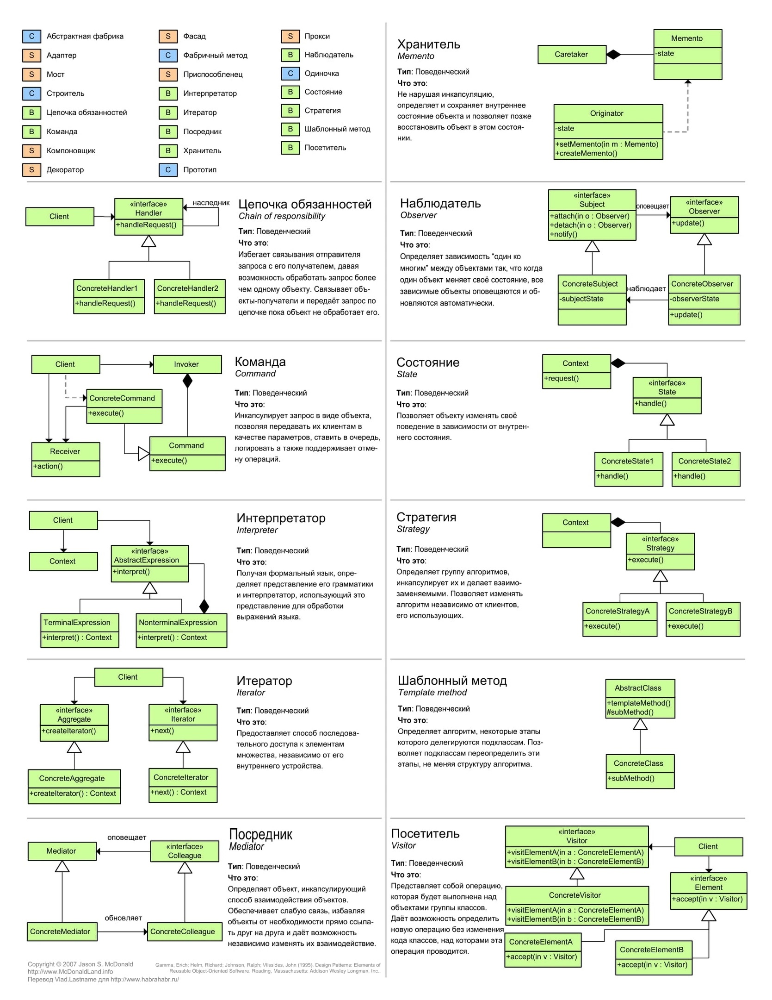
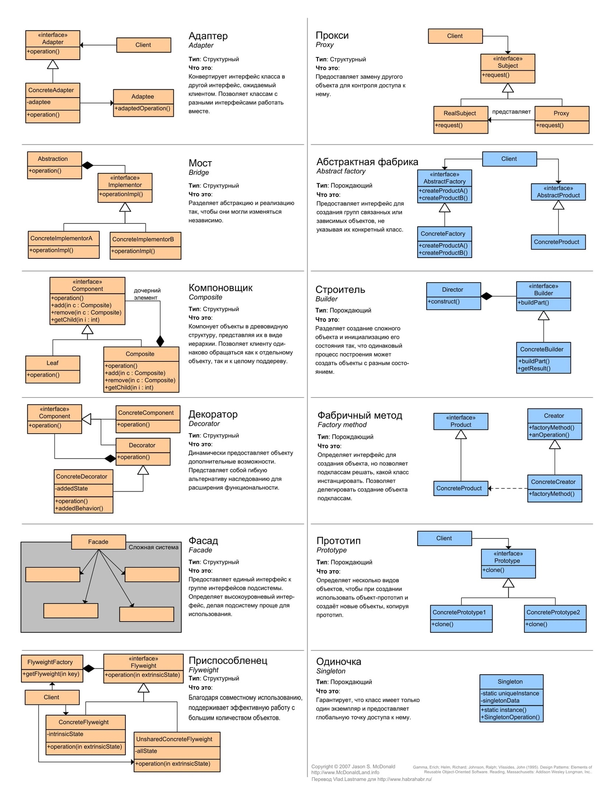
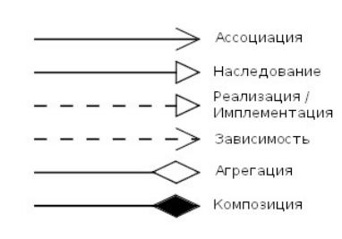

## Паттерны (пишутся)

https://www.youtube.com/watch?v=wX6BBaQZpzE
https://github.com/ak-git1/PatternsExamples (с#)

- автоматизация куда полезнее ООП

**Фабрика** - это шаблон проектирования, который помогает решить проблему создания различных объектов в зависимости от
некоторых условий

**Состояние** (изменять свое поведение в зависимости от внутреннего состояния.)

**Адаптер**  (поменять порядок вхожденных переменных в функции)

**Команда** ( цель: лямбда функция которую мы передаем в функцию высшего порядка, разделяет интерфейсы, Callback, какое
то действие на какое, то событие )

Паттерн Action === Команда гласит, что логику нужно обёртывать в классы Action. Эта идея не нова, в других сообществах продвигалась «Чистая архитектура», при которой каждый «сценарий использования» (или Interactor) должен являться самостоятельным классом.

**Декоратор** (суть: расширение поведения(оборачивание функциональности), не затрагивать клиентский код и он не узнает
что произошло снаружи) Wrapper function - одну штуку обернули в другую, обозначаетс пунктирным линями.

**Фасад** - это больше идея чем паттерн ( цель: позволяющий скрыть сложность системы путём сведения всех возможных
внешних вызовов к одному объекту )

**Абстрактная фабрика** ( где используется: есть некоторые наборы связных компонентов и в связи с ситуацией мы хотим
принимать один набор или другой. например: для одной библиотеки есть свой набор но если мы хотим поменять то просто
меняем, главные смысл что есть набор связных списков, классов. Редко будем использовать )

**Реестр** - глобальная переменная изменяема, замены глобальных переменных, , ибо глобальные переменные это не очень
хорошо. ( используется для передачи данных между модулями заменяя глобальные переменные ) но если ты используешь этот
паттерн то в твоей программе есть проблемы.

**Антипаттерн** - любой систематический неправильный код

**Singleton** - единственный экземпляр некоторого класса, и предоставляющий глобальную точку доступа к этому
экземпляру. (создаётся глобальная переменная, их использовать плохо, любая часть системы меняет глобальное состояние, то
другая часть может поломается, и у программиста нет простого способа узнать о том, что это произошло ) Решает проблему
возможности запрета создание второго экземпляра

(Почему используют: задается вопрос как объект передаться в обработчике или во view, опрокинуть его, отовсюду можно
опрокинуть )

( Если используешь ;$val = new… то это уже не полиморфизм, для решение
использовать [Dependency Injection](https://github.com/PHP-DI/PHP-DI/blob/master/doc/understanding-di.md), инверсия
зависимости, контейнеры )

**Public Морозов** - Класс-потомок, созданный в соответствии с этим антипаттером, выдает по запросу все данные
класса-предка, независимо от степени их сокрытия

Если используешь ОПП и полиморфизм и вместе с ним проверку типов то первые два уничтожаются.

Автоматы требуют goto и не используя его и получишь структурный код, его ни в коем случае нельзя использовать в
прикладном коде.

Шпоргалка:

